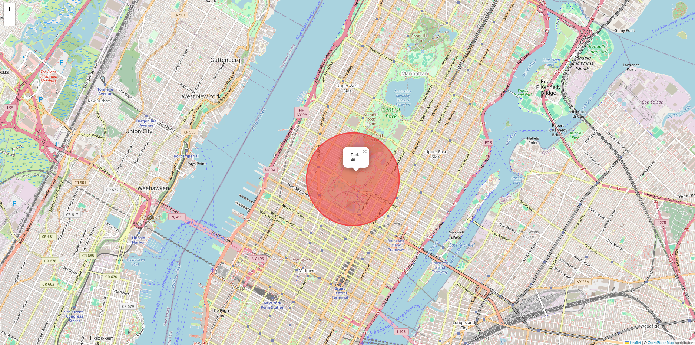

## LaughAtlas: Mapping Laughter Frequencies in Public Spaces



This project detects, logs, and analyzes human laughter in public spaces using local microphones and classical audio ML. No API keys required. It is designed as a portfolio-ready, reproducible data analyst project you can run on a laptop or small edge device.

### What you get
- Train a laughter detector from the public ESC-50 dataset (contains a "laughing" class) — downloaded directly, no keys.
- Real-time local detection via your device microphone; events are written to a SQLite database with timestamps and a location tag you choose.
- Analysis script to produce temporal plots and an interactive folium map of laughter density by location.

### Quick start
1) Create a Python environment (3.10+ recommended) and install deps:
```
pip install -r requirements.txt
```

2) Download the ESC-50 dataset (public, includes audio) and prepare training data:
```
python -m src.data.download_esc50
```

3) Train the laughter detector:
```
python -m src.models.train
```

4) Set your sensor location name and (optionally) lat/lon in `config/locations.json`.
   - Example entries are included: "Park", "Plaza", "Cafe".

5) Run real-time detection from your built-in mic, logging to SQLite:
```
python -m src.realtime.listen_and_detect --location "Park" --threshold 0.8 --window 2.0 --hop 1.0
```
Let it run in places you care about. Repeat with different `--location` values on other devices or at other places/times.

Optional (fast demo without microphone): backfill events from ESC-50 for plotting
```
python -m src.data.backfill_from_esc50 --location "Park" --days 10 --max_events 300
```

6) Analyze logged events and generate a map + plots:
```
python -m src.analysis.analyze_events
```
Outputs go to `outputs/`:
- `laughter_by_hour.png`: barplot of laughter events by hour of day
- `laughter_timeseries_daily.png`: daily time series
- `laughter_map.html`: folium map sized by event counts per location

### How it works (brief)
- Model: Classical ML with `scikit-learn` using MFCCs and spectral features (no deep learning needed). Positive class is ESC-50 "laughing"; negatives are the remaining classes.
- Inference: Audio windows (default 2 s, 50% overlap) are converted to features and classified; if probability > threshold, an event is logged.
- Analytics: Events are aggregated by location and time, then visualized. Location coordinates come from `config/locations.json`.

### Notes
- All components run locally; no cloud, no API keys.
- For better spatial analysis, deploy the detector on multiple laptops or small devices (e.g., Raspberry Pi with USB mic), each using a distinct `--location` label.
- You can later enrich `data/events.sqlite` with public CSVs (e.g., weather) by joining on date/time.

### Troubleshooting
- If `sounddevice` fails to access your microphone on Windows, ensure microphone permissions are enabled for Python and your terminal, and update audio drivers.
- If `librosa` fails on missing system libs, try upgrading `pip` and `wheel`: `python -m pip install --upgrade pip wheel`.


